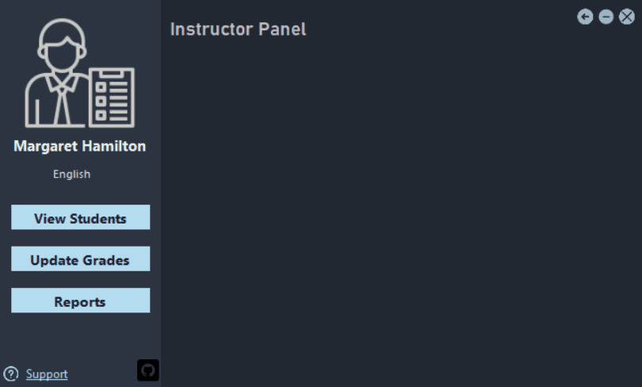
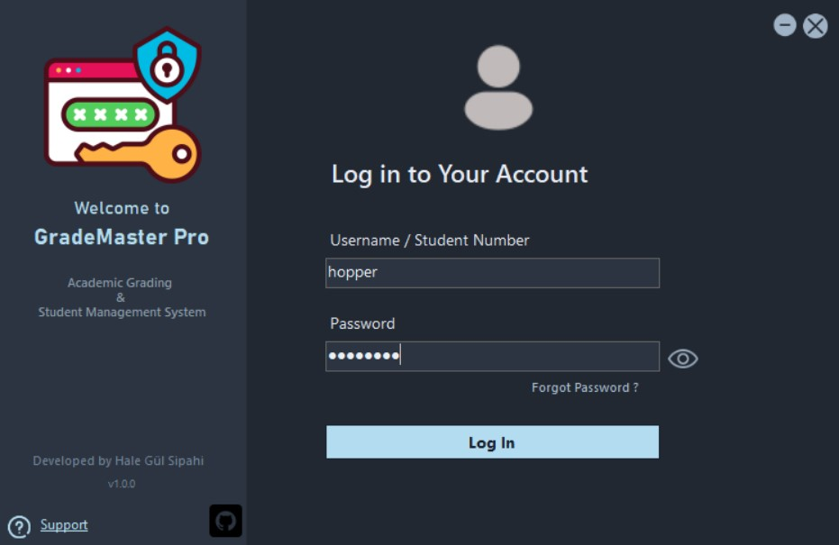
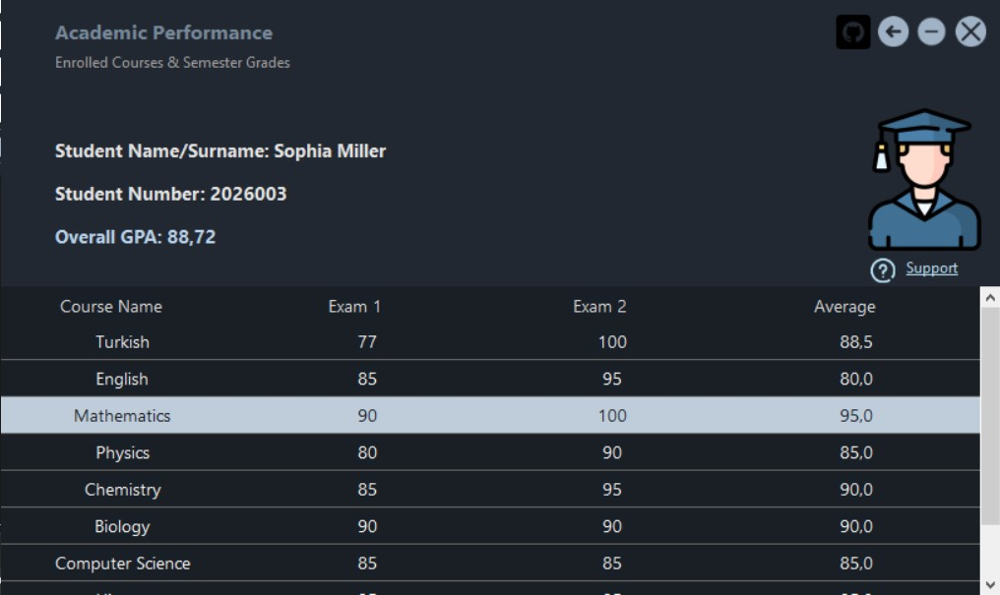

# GradeMasterPro 🎓

An enterprise-inspired Academic Performance & Student Evaluation desktop system built with **C# (.NET Windows Forms)** and **Microsoft Access (OleDb)**. Designed around a dual-role authentication model (Instructor & Student), real-time relational data synchronization, dynamic GPA calculation, and aggregate statistical reporting.

<div align="center">
  
</div>

---

## 📸 User Interface Showcase

| Authentication Portal | Student Dashboard |
| :---: | :---: |
|  |  |

---

## ⚡ Key Capabilities & Features

### 👩‍🏫 Instructor Panel
* **Live Roster Display:** Instantly retrieves and tabulates enrolled student records via parameterized OleDb queries.
* **Student Enrollment:** Dedicated module to register new students, assign initial academic credentials, and map course enrollments dynamically.
* **Dynamic Evaluation (CRUD):** Rapid grade update flow with automated evaluation criteria, conditional status flags (`Passed` / `Failed!`), and real-time database sync.
* **Real-Time Analytics:** Dynamic aggregates that compute class averages, passing rates, and student volume metrics.

### 👨‍🎓 Student Portal
* **Dynamic GPA Computation:** Calculates cumulative and evaluation-based GPA dynamically across course submissions.
* **Customized Academic Grid:** Stylized `DataGridView` configured for high legibility, formatted metrics, and custom cell styling.
* **Academic Support System:** Integrated communication flow for advisory queries and evaluation appeals.

### 🎨 Modern Windows Forms UX
* **Borderless Draggable UI:** Custom window dragging enabled via Win32 API Interoperability (`User32.dll` - `SendMessage` & `ReleaseCapture`).
* **Custom Dark Theme:** Modern `#222831` flat palette with high-contrast active states and password visibility toggles.
* **Bundled Assets:** Complete set of vector-style UI icons (`img/` directory) for consistent visual communication.

---

## 🛠️ Technical Stack & Architecture

* **Language & Framework:** C# (.NET Framework / Windows Forms)
* **Database Engine:** Microsoft Access (`.mdb` via `System.Data.OleDb`)
* **Security & Reliability:** Fully parameterized SQL queries preventing SQL injection, coupled with defensive data validation.
* **Native API Interop:** Win32 API calls for non-standard borderless form dragging and window handling.

---

## 📂 Project Structure

```text
GradeMasterPro/
├── GradeMasterPro/               # Source code & Form implementations
│   ├── Forms/                    # Windows Forms controllers & views
│   ├── Properties/               # Project properties & resources
│   ├── App.config                # Connection strings & runtime configurations
│   └── Program.cs                # Application entry point
├── Screenshots/                  # Showcase GIFs & screenshots for documentation
├── img/                          # UI icons and custom graphic assets
├── GradeMasterProDB.mdb          # Microsoft Access database with seed records
├── GradeMasterPro.slnx           # Visual Studio Solution
└── README.md                     # Project documentation
```

---

## ⚙️ Local Setup & Getting Started

### Prerequisites
* Windows OS
* Visual Studio 2022 (.NET desktop development workload enabled)
* Microsoft Access Database Engine Redistributable (if 32/64-bit OleDb drivers are not present)

### Installation
1. **Clone the Repository:**
   git clone [https://github.com/halegulsipahi/GradeMasterPro.git](https://github.com/halegulsipahi/GradeMasterPro.git)

2. **Open the Project:**
   * Open `GradeMasterPro.slnx` using Visual Studio 2022.

3. **Database Configuration:**
   * The pre-populated database (`GradeMasterProDB.mdb`) is included at the root of the repository.
   * Ensure `GradeMasterProDB.mdb` is placed inside your build output directory (`bin\Debug` or `bin\Release`) or verify that the connection string in `App.config` points to its local path.

4. **Build & Run:**
   * Press F5 in Visual Studio to compile and run the project.

---

## 👩‍💻 Author

**Hale Gül Sipahi**  
* GitHub: @halegulsipahi
